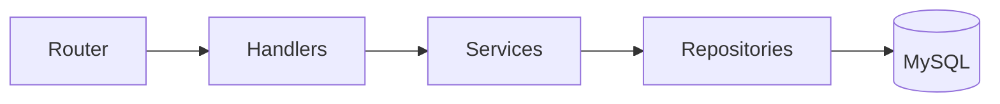

# 交易复盘系统 — 实现总结

## 项目概览

完成了一个全栈交易复盘系统，前端 + 后端 + 数据库全部容器化。

| 层级 | 技术栈 | 状态 |
|------|--------|------|
| 前端 | React 18 + Vite + Ant Design 5 + Recharts + Redux Toolkit (RTK Query) | ✅ 构建通过 |
| 后端 | Go 1.22 + Gin + GORM + MySQL Driver | ✅ 代码完成 |
| 数据库 | MySQL 8.0 | ✅ Docker 配置完成 |
| 基础设施 | Docker Compose | ✅ 配置完成 |

---

## 文件清单 (40+ 文件)

### 基础设施 (5 files)

| 文件 | 说明 |
|------|------|
| [docker-compose.yml](file:///c:/ws/trading-review-system/docker-compose.yml) | MySQL + Go Backend + React Frontend 容器编排 |
| [.env](file:///c:/ws/trading-review-system/.env) | 环境变量 (数据库密码) |
| [.gitignore](file:///c:/ws/trading-review-system/.gitignore) | Git 忽略规则 |
| [backend/Dockerfile](file:///c:/ws/trading-review-system/backend/Dockerfile) | Go 多阶段构建 |
| [frontend/Dockerfile](file:///c:/ws/trading-review-system/frontend/Dockerfile) | Node 构建 + Nginx 部署 |

---

### Go 后端 (26 files)

#### 入口 & 配置
| 文件 | 说明 |
|------|------|
| [main.go](file:///c:/ws/trading-review-system/backend/cmd/server/main.go) | 程序入口，依赖注入 |
| [config.go](file:///c:/ws/trading-review-system/backend/internal/config/config.go) | 环境变量配置加载 |
| [database.go](file:///c:/ws/trading-review-system/backend/internal/database/database.go) | MySQL 连接 + 连接池 |
| [migration.go](file:///c:/ws/trading-review-system/backend/internal/database/migration.go) | GORM 自动迁移 |

#### Models (7 个 GORM 模型)
| 文件 | 说明 |
|------|------|
| [trade.go](file:///c:/ws/trading-review-system/backend/internal/models/trade.go) | 交易主表 (含关联预加载) |
| [order.go](file:///c:/ws/trading-review-system/backend/internal/models/order.go) | 订单记录 |
| [entry_decision.go](file:///c:/ws/trading-review-system/backend/internal/models/entry_decision.go) | 入场决策 (含自定义 JSON 类型) |
| [exit_plan.go](file:///c:/ws/trading-review-system/backend/internal/models/exit_plan.go) | 出场计划 |
| [tag.go](file:///c:/ws/trading-review-system/backend/internal/models/tag.go) | 标签 |
| [trade_tag.go](file:///c:/ws/trading-review-system/backend/internal/models/trade_tag.go) | 交易-标签关联表 |
| [review.go](file:///c:/ws/trading-review-system/backend/internal/models/review.go) | 复盘记录 |

#### Repository → Service → Handler (分层架构)



---

### React 前端 (12 files)

#### 核心
| 文件 | 说明 |
|------|------|
| [main.jsx](file:///c:/ws/trading-review-system/frontend/src/main.jsx) | 入口 (Redux + Router + Ant Design 暗色主题) |
| [App.jsx](file:///c:/ws/trading-review-system/frontend/src/App.jsx) | 布局 + 路由 |
| [store.js](file:///c:/ws/trading-review-system/frontend/src/app/store.js) | Redux Store |
| [api.js](file:///c:/ws/trading-review-system/frontend/src/app/api.js) | RTK Query (全部 22 个 API endpoints) |

#### 5 个页面
| 页面 | 说明 |
|------|------|
| [Dashboard.jsx](file:///c:/ws/trading-review-system/frontend/src/pages/Dashboard.jsx) | 仪表盘：SummaryCards + 收益曲线 + 胜率图 + 评分分布 + 最近交易 |
| [Trades.jsx](file:///c:/ws/trading-review-system/frontend/src/pages/Trades.jsx) | 交易列表：筛选栏 + 分页表格 |
| [TradeDetail.jsx](file:///c:/ws/trading-review-system/frontend/src/pages/TradeDetail.jsx) | ⭐ 交易详情：入场决策 + 出场计划 + 订单时间线 + 标签 + 复盘 |
| [TradeForm.jsx](file:///c:/ws/trading-review-system/frontend/src/pages/TradeForm.jsx) | ⭐ 新建/编辑交易：基本信息 + 入场决策表单 + 出场计划 + 分批计划 |
| [Analysis.jsx](file:///c:/ws/trading-review-system/frontend/src/pages/Analysis.jsx) | ⭐ 分析中心：信号分析 + 标签分析 + 市场分析 + 执行分析 |

---

## API 路由一览 (22 个 endpoints)

| 方法 | 路径 | 说明 |
|------|------|------|
| `GET` | `/api/trades` | 交易列表 (筛选+分页) |
| `POST` | `/api/trades` | 创建交易 |
| `GET` | `/api/trades/:id` | 交易详情 (聚合数据) |
| `PUT` | `/api/trades/:id` | 更新交易 |
| `DELETE` | `/api/trades/:id` | 删除交易 |
| `POST` | `/api/trades/:id/orders` | 添加订单 |
| `PUT` | `/api/trades/:id/entry-decision` | Upsert 入场决策 |
| `PUT` | `/api/trades/:id/exit-plan` | Upsert 出场计划 |
| `PUT` | `/api/trades/:id/tags` | 设置标签 |
| `PUT` | `/api/trades/:id/review` | Upsert 复盘 |
| `PUT` | `/api/orders/:id` | 更新订单 |
| `DELETE` | `/api/orders/:id` | 删除订单 |
| `GET` | `/api/tags` | 标签列表 |
| `POST` | `/api/tags` | 创建标签 |
| `GET` | `/api/dashboard/summary` | 仪表盘统计 |
| `GET` | `/api/dashboard/equity-curve` | 收益曲线 |
| `GET` | `/api/dashboard/win-rate` | 胜率趋势 |
| `GET` | `/api/dashboard/recent-trades` | 最近交易 |
| `GET` | `/api/analysis/signals` | 信号分析 |
| `GET` | `/api/analysis/tags` | 标签分析 |
| `GET` | `/api/analysis/market` | 市场分析 |
| `GET` | `/api/analysis/execution` | 执行分析 |

---

## 启动方式

```bash
# 一键启动所有服务
docker compose up --build

# 访问地址
# 前端: http://localhost:3000
# 后端: http://localhost:8080
# MySQL: localhost:3306
```

> [!IMPORTANT]
> 首次启动时，GORM 会自动创建所有数据库表 (AutoMigrate)。无需手动执行 SQL。

> [!TIP]
> 本地开发时，可以单独启动前端 `cd frontend && npm run dev` (端口 5173)，Vite 会自动代理 `/api` 到 `localhost:8080`。

---

## 验证结果

| 验证项 | 结果 |
|--------|------|
| 前端 Vite build | ✅ 构建成功 (3847 modules, 24.5s) |
| 后端代码结构 | ✅ 9 个模块, 26 个文件 |
| Docker Compose 配置 | ✅ 3 个服务 (db + backend + frontend) |
